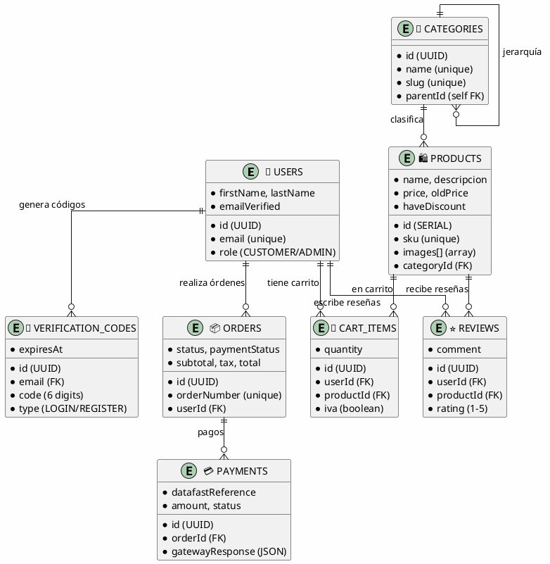

# Diagrama Entidad-Relación - Ecommerce AstroCore

## Diagrama ER Completo (PlantUML)

```plantuml
@startuml Ecommerce_AstroCore_ER

!define PRIMARY_KEY(x) <b><color:#b8860b><&key></color> x</b>
!define FOREIGN_KEY(x) <color:#aaaaaa><&key></color> x
!define UNIQUE(x) <color:#green><&asterisk></color> x
!define NOT_NULL(x) <color:#red>x</color>

skinparam linetype ortho
skinparam backgroundColor #FEFEFE
skinparam entity {
  BackgroundColor #E1F5FE
  BorderColor #0277BD
  FontSize 11
}

skinparam class {
  BackgroundColor #F3E5F5
  BorderColor #7B1FA2
  FontSize 10
}

' =====================================================
' ENTIDADES PRINCIPALES
' =====================================================

entity "users" as users {
  PRIMARY_KEY(id) : TEXT <<UUID>>
  --
  UNIQUE(email) : TEXT <<NOT NULL>>
  NOT_NULL(firstName) : TEXT
  NOT_NULL(lastName) : TEXT
  phone : TEXT
  NOT_NULL(isActive) : BOOLEAN <<DEFAULT: true>>
  NOT_NULL(role) : UserRole <<DEFAULT: CUSTOMER>>
  NOT_NULL(emailVerified) : BOOLEAN <<DEFAULT: false>>
  NOT_NULL(createdAt) : TIMESTAMP <<DEFAULT: NOW()>>
  NOT_NULL(updatedAt) : TIMESTAMP <<AUTO UPDATE>>
}

entity "verification_codes" as verification_codes {
  PRIMARY_KEY(id) : TEXT <<UUID>>
  --
  FOREIGN_KEY(email) : TEXT <<NOT NULL>>
  NOT_NULL(code) : CHAR(6)
  NOT_NULL(type) : VerificationCodeType
  NOT_NULL(isUsed) : BOOLEAN <<DEFAULT: false>>
  NOT_NULL(expiresAt) : TIMESTAMP
  NOT_NULL(createdAt) : TIMESTAMP <<DEFAULT: NOW()>>
}

entity "categories" as categories {
  PRIMARY_KEY(id) : TEXT <<UUID>>
  --
  UNIQUE(name) : TEXT <<NOT NULL>>
  UNIQUE(slug) : TEXT <<NOT NULL>>
  description : TEXT
  image : TEXT
  NOT_NULL(isActive) : BOOLEAN <<DEFAULT: true>>
  FOREIGN_KEY(parentId) : TEXT
  NOT_NULL(createdAt) : TIMESTAMP <<DEFAULT: NOW()>>
  NOT_NULL(updatedAt) : TIMESTAMP <<AUTO UPDATE>>
}

entity "products" as products {
  PRIMARY_KEY(id) : SERIAL <<AUTO INCREMENT>>
  --
  NOT_NULL(name) : TEXT
  UNIQUE(slug) : TEXT <<NOT NULL>>
  descripcion : TEXT
  shortDesc : TEXT
  UNIQUE(sku) : TEXT <<NOT NULL>>
  NOT_NULL(price) : DECIMAL(10,2)
  oldPrice : DECIMAL(10,2)
  NOT_NULL(haveDiscount) : BOOLEAN <<DEFAULT: false>>
  cost : DECIMAL(10,2)
  NOT_NULL(trackQuantity) : BOOLEAN <<DEFAULT: true>>
  NOT_NULL(quantity) : INTEGER <<DEFAULT: 0>>
  weight : DECIMAL(8,2)
  dimensions : TEXT
  NOT_NULL(status) : ProductStatus <<DEFAULT: DRAFT>>
  NOT_NULL(isActive) : BOOLEAN <<DEFAULT: true>>
  NOT_NULL(isFeatured) : BOOLEAN <<DEFAULT: false>>
  images : TEXT[] <<ARRAY>>
  tags : TEXT[] <<ARRAY>>
  category : TEXT
  metaTitle : TEXT
  metaDesc : TEXT
  FOREIGN_KEY(categoryId) : TEXT
  NOT_NULL(createdAt) : TIMESTAMP <<DEFAULT: NOW()>>
  NOT_NULL(updatedAt) : TIMESTAMP <<AUTO UPDATE>>
}

entity "product_variants" as product_variants {
  PRIMARY_KEY(id) : TEXT <<UUID>>
  --
  FOREIGN_KEY(productId) : INTEGER <<NOT NULL>>
  NOT_NULL(name) : TEXT
  NOT_NULL(value) : TEXT
  price : DECIMAL(10,2)
  sku : TEXT
  NOT_NULL(quantity) : INTEGER <<DEFAULT: 0>>
}

entity "addresses" as addresses {
  PRIMARY_KEY(id) : TEXT <<UUID>>
  --
  FOREIGN_KEY(userId) : TEXT <<NOT NULL>>
  NOT_NULL(firstName) : TEXT
  NOT_NULL(lastName) : TEXT
  company : TEXT
  NOT_NULL(address1) : TEXT
  address2 : TEXT
  NOT_NULL(city) : TEXT
  NOT_NULL(state) : TEXT
  NOT_NULL(postalCode) : TEXT
  NOT_NULL(country) : TEXT <<DEFAULT: 'EC'>>
  phone : TEXT
  NOT_NULL(isDefault) : BOOLEAN <<DEFAULT: false>>
  instructions : TEXT
}

entity "cart_items" as cart_items {
  PRIMARY_KEY(id) : TEXT <<UUID>>
  --
  FOREIGN_KEY(userId) : TEXT <<NOT NULL>>
  FOREIGN_KEY(productId) : INTEGER <<NOT NULL>>
  NOT_NULL(quantity) : INTEGER <<DEFAULT: 1>>
  NOT_NULL(iva) : BOOLEAN <<DEFAULT: true>>
  NOT_NULL(createdAt) : TIMESTAMP <<DEFAULT: NOW()>>
  NOT_NULL(updatedAt) : TIMESTAMP <<AUTO UPDATE>>
  ..
  UNIQUE(userId, productId)
}

entity "orders" as orders {
  PRIMARY_KEY(id) : TEXT <<UUID>>
  --
  UNIQUE(orderNumber) : TEXT <<NOT NULL>>
  FOREIGN_KEY(userId) : TEXT <<NOT NULL>>
  NOT_NULL(status) : OrderStatus <<DEFAULT: PENDING>>
  NOT_NULL(paymentStatus) : PaymentStatus <<DEFAULT: PENDING>>
  paymentMethod : TEXT
  NOT_NULL(subtotal) : DECIMAL(10,2)
  NOT_NULL(tax) : DECIMAL(10,2) <<DEFAULT: 0>>
  NOT_NULL(shipping) : DECIMAL(10,2) <<DEFAULT: 0>>
  NOT_NULL(discount) : DECIMAL(10,2) <<DEFAULT: 0>>
  NOT_NULL(total) : DECIMAL(10,2)
  NOT_NULL(currency) : TEXT <<DEFAULT: 'USD'>>
  notes : TEXT
  FOREIGN_KEY(shippingAddressId) : TEXT
  NOT_NULL(createdAt) : TIMESTAMP <<DEFAULT: NOW()>>
  NOT_NULL(updatedAt) : TIMESTAMP <<AUTO UPDATE>>
}

entity "order_items" as order_items {
  PRIMARY_KEY(id) : TEXT <<UUID>>
  --
  FOREIGN_KEY(orderId) : TEXT <<NOT NULL>>
  FOREIGN_KEY(productId) : INTEGER <<NOT NULL>>
  NOT_NULL(quantity) : INTEGER
  NOT_NULL(price) : DECIMAL(10,2)
  NOT_NULL(total) : DECIMAL(10,2)
}

entity "payments" as payments {
  PRIMARY_KEY(id) : TEXT <<UUID>>
  --
  FOREIGN_KEY(orderId) : TEXT <<NOT NULL>>
  UNIQUE(transactionId) : TEXT
  UNIQUE(datafastReference) : TEXT
  NOT_NULL(amount) : DECIMAL(10,2)
  NOT_NULL(currency) : TEXT <<DEFAULT: 'USD'>>
  NOT_NULL(status) : PaymentStatus <<DEFAULT: PENDING>>
  NOT_NULL(method) : TEXT <<DEFAULT: 'datafast'>>
  NOT_NULL(gateway) : TEXT <<DEFAULT: 'datafast'>>
  gatewayResponse : JSONB
  failureReason : TEXT
  processedAt : TIMESTAMP
  NOT_NULL(createdAt) : TIMESTAMP <<DEFAULT: NOW()>>
  NOT_NULL(updatedAt) : TIMESTAMP <<AUTO UPDATE>>
}

entity "reviews" as reviews {
  PRIMARY_KEY(id) : TEXT <<UUID>>
  --
  FOREIGN_KEY(userId) : TEXT <<NOT NULL>>
  FOREIGN_KEY(productId) : INTEGER <<NOT NULL>>
  NOT_NULL(rating) : INTEGER <<CHECK: 1-5>>
  title : TEXT
  comment : TEXT
  NOT_NULL(isVerified) : BOOLEAN <<DEFAULT: false>>
  NOT_NULL(createdAt) : TIMESTAMP <<DEFAULT: NOW()>>
  NOT_NULL(updatedAt) : TIMESTAMP <<AUTO UPDATE>>
  ..
  UNIQUE(userId, productId)
}

' =====================================================
' ENUMS
' =====================================================

enum UserRole {
  CUSTOMER
  ADMIN
  SUPER_ADMIN
}

enum VerificationCodeType {
  LOGIN
  REGISTER
  PASSWORD_RESET
}

enum ProductStatus {
  DRAFT
  ACTIVE
  ARCHIVED
}

enum OrderStatus {
  PENDING
  CONFIRMED
  PROCESSING
  SHIPPED
  DELIVERED
  CANCELLED
  REFUNDED
}

enum PaymentStatus {
  PENDING
  PROCESSING
  COMPLETED
  FAILED
  CANCELLED
  REFUNDED
}

' =====================================================
' RELACIONES
' =====================================================

' Usuario y códigos de verificación (1:N)
users ||--o{ verification_codes : "genera"
verification_codes }o--|| users : "email"

' Usuario y direcciones (1:N)
users ||--o{ addresses : "posee"

' Usuario y carrito (1:N)
users ||--o{ cart_items : "tiene"

' Usuario y órdenes (1:N)
users ||--o{ orders : "realiza"

' Usuario y reseñas (1:N)
users ||--o{ reviews : "escribe"

' Categorías jerárquicas (1:N auto-referencia)
categories ||--o{ categories : "contiene\n(parentId)"

' Categorías y productos (1:N)
categories ||--o{ products : "clasifica"

' Productos y variantes (1:N)
products ||--o{ product_variants : "tiene"

' Productos y carrito (1:N)
products ||--o{ cart_items : "incluido_en"

' Productos y items de orden (1:N)
products ||--o{ order_items : "vendido_como"

' Productos y reseñas (1:N)
products ||--o{ reviews : "recibe"

' Direcciones y órdenes (1:N)
addresses ||--o{ orders : "enviado_a"

' Órdenes y items (1:N)
orders ||--o{ order_items : "contiene"

' Órdenes y pagos (1:N)
orders ||--o{ payments : "pagado_con"

' =====================================================
' NOTAS Y LEYENDAS
' =====================================================

note top of users : **USUARIOS**\nAutenticación passwordless\nSin campo password\nVerificación por email
note top of verification_codes : **CÓDIGOS VERIFICACIÓN**\n6 dígitos\nExpiración 10-15 min\nUn solo uso
note top of products : **PRODUCTOS**\nAlineado con frontend\nID numérico auto-increment\nArray de imágenes
note top of cart_items : **CARRITO**\nCampo IVA para Ecuador\nRelación única usuario-producto
note top of payments : **PAGOS**\nIntegración Datafast\nReferencia única\nRespuesta JSON

note bottom of orders : **CÁLCULO AUTOMÁTICO**\nSubtotal + IVA (12%) + Envío - Descuento = Total

legend right
  |= Símbolo |= Significado |
  | <&key> | Clave primaria/foránea |
  | <&asterisk> | Campo único |
  | <color:#red>Campo</color> | No nulo |
  | <<DEFAULT: valor>> | Valor por defecto |
  | <<AUTO UPDATE>> | Actualización automática |
  | <<ARRAY>> | Array PostgreSQL |
  | <<CHECK: condición>> | Restricción de validación |
endlegend

@enduml
```

## Diagrama ER Simplificado (Relaciones Principales)



## Características del Diagrama PlantUML

### 🎨 **Ventajas de PlantUML sobre Mermaid**

1. **Mayor Detalle**: Muestra tipos de datos, constraints, defaults
2. **Mejor Legibilidad**: Colores y símbolos para diferentes tipos de campos
3. **Profesional**: Formato estándar en documentación técnica
4. **Exportable**: PDF, PNG, SVG de alta calidad
5. **Versionable**: Texto plano fácil de versionar

### 🔧 **Elementos Visuales**

- **🔑 Claves Primarias**: Símbolo de llave dorada
- **🔗 Claves Foráneas**: Símbolo de llave gris
- **⭐ Campos Únicos**: Asterisco verde
- **❗ Campos No Nulos**: Texto en rojo
- **📋 Enums**: Listados separados
- **📝 Notas**: Explicaciones contextuales

### 📊 **Dos Versiones Incluidas**

1. **Diagrama Completo**: Todos los campos, tipos, constraints
2. **Diagrama Simplificado**: Solo relaciones principales con emojis

## 🚀 Cómo Usar los Diagramas

### Visualización Online
1. Ir a [PlantUML Online](http://www.plantuml.com/plantuml/uml/)
2. Copiar el código PlantUML
3. Ver el diagrama renderizado

### Exportar como Imagen
```bash
# Instalar PlantUML
npm install -g node-plantuml

# Generar PNG
plantuml entity_relationship_diagram.md
```

### Integración en IDEs
- **VS Code**: Extensión "PlantUML"
- **IntelliJ**: Plugin "PlantUML Integration"
- **Vim**: Plugin "plantuml-syntax"

## 📋 Información Técnica Detallada

### Tipos de Datos PostgreSQL
- `TEXT` - Texto variable
- `SERIAL` - Auto-increment integer
- `DECIMAL(10,2)` - Números decimales con precisión
- `BOOLEAN` - Verdadero/falso
- `TIMESTAMP` - Fecha y hora
- `JSONB` - JSON binario optimizado
- `TEXT[]` - Array de texto

### Constraints Implementados
- `PRIMARY KEY` - Clave primaria
- `FOREIGN KEY` - Clave foránea
- `UNIQUE` - Valor único
- `NOT NULL` - No nulo
- `CHECK` - Validación personalizada
- `DEFAULT` - Valor por defecto

### Índices de Performance
- Índices únicos en emails, SKUs, números de orden
- Índices compuestos para consultas frecuentes
- Índices en claves foráneas para JOINs rápidos

---

**Actualizado:** 25/08/2025 - 17:15  
**Formato:** PlantUML  
**Versión:** 2.0  
**Compatible con:** PostgreSQL 14+
